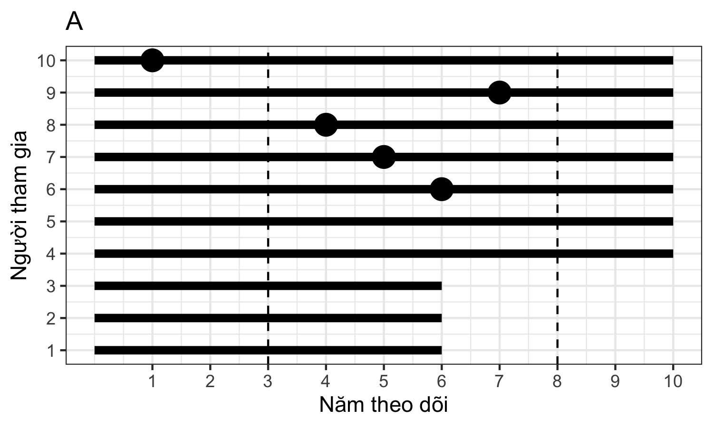
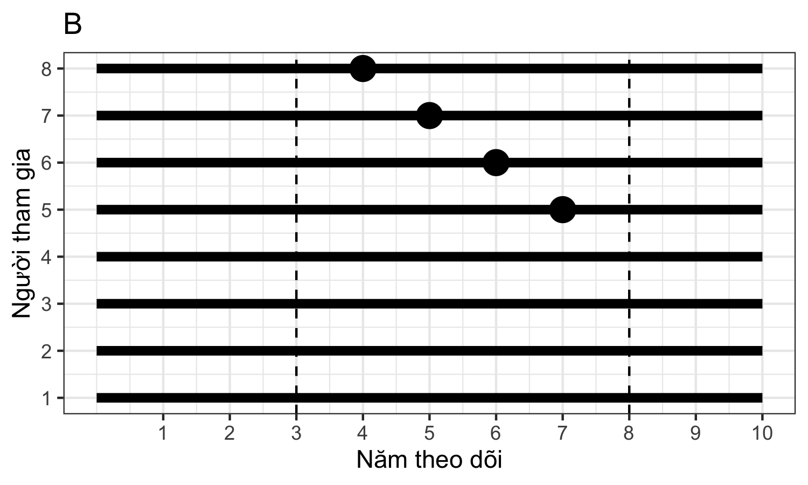
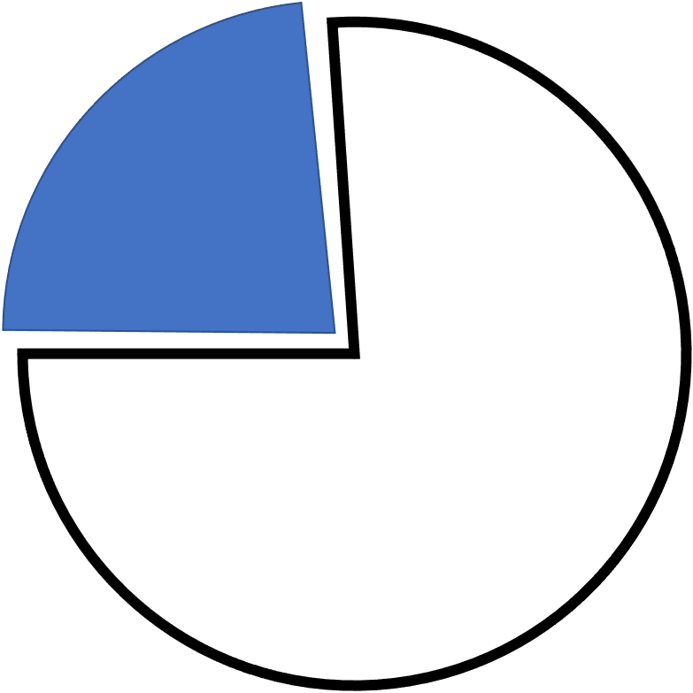
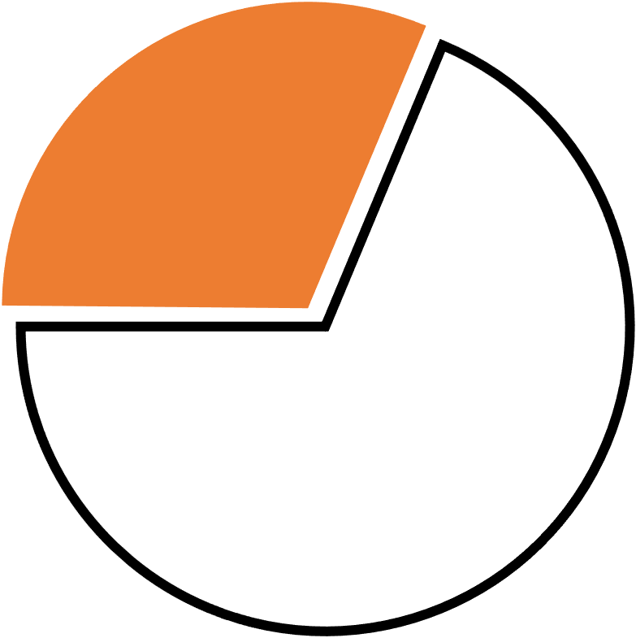
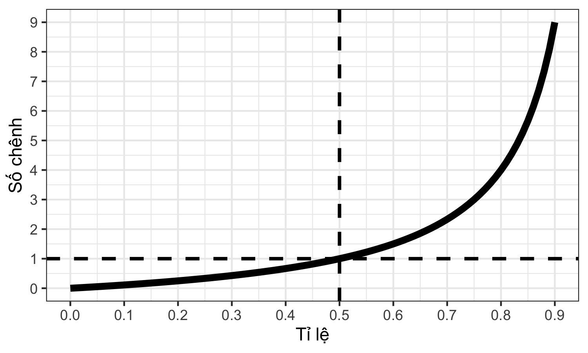
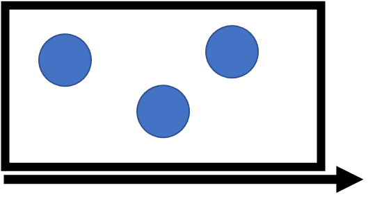
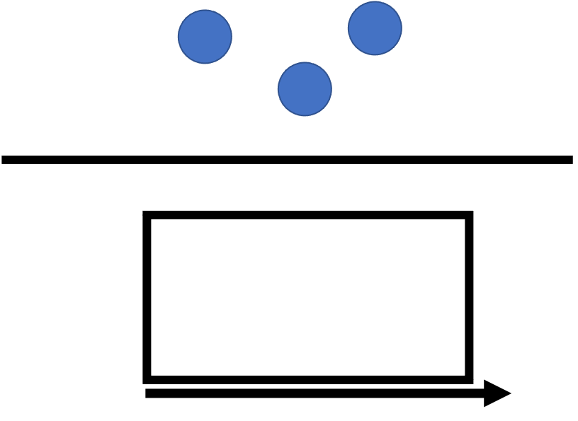
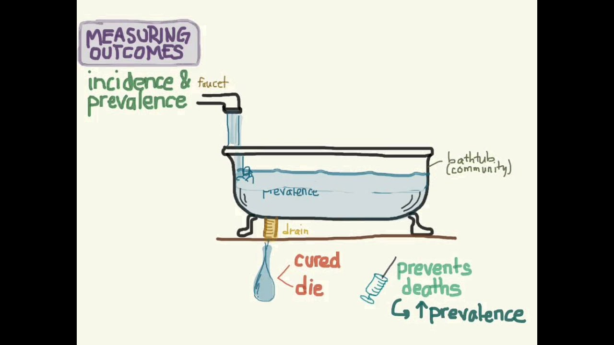

```{r setup, include=FALSE}
options(htmltools.dir.version = FALSE)
```

```{r xaringan-themer, include = FALSE}
library(xaringanthemer)
style_mono_light(
  base_color = "#002147",
  header_font_google = google_font('Yanone Kaffeesatz'),
  text_font_google   = google_font("Yanone Kaffeesatz"),
  code_font_google   = google_font("Inconsolata", "monospace"),
  base_font_size = "20px",
  text_font_size = "1.5rem"
)
```

# Mục tiêu

1. Định nghĩa và phân biệt được ý nghĩa của số mới mắc (nguy cơ, tỉ suất), và số hiện mắc.

2. Lựa chọn và tính toán được những số đo lường bệnh trạng thích hợp cho một nghiên cứu dịch tễ học.

3. Lý giải được ý nghĩa của những số đo lường bệnh trạng trong một nghiên cứu dịch tễ học.

---

# Thảo luận

Chương trình giám sát bệnh tăng huyết áp trong vòng 10 năm tại A và B

A: 10 người, B: 8 người

Chưa ai bị tăng huyết áp tại thời điểm bắt đầu

---



--

 

 

 

 

 

Trong khoảng thời gian từ năm thứ 3 đến năm thứ 8:

1.	Bệnh tăng huyết áp ở đâu phổ biến hơn? Vì sao?

2.	Nguy cơ mắc bệnh tăng huyết áp ở đâu cao hơn? Vì sao?

---
class: inverse, center, middle

# KHÁI NIỆM CƠ BẢN

---

# Đoàn hệ (Cohort)

--


--

 

 

 

 

 

Đoàn hệ đóng (closed cohort) vs. Đoàn hệ mở (open cohort)

???

Đoàn hệ: một nhóm người được theo dõi theo thời gian
Đoàn hệ đóng: bắt đầu theo dõi cùng lúc, không thêm người mới --> giữ nguyên hoặc giảm dần theo thời gian
Đoàn hệ mở: thêm người mới --> lớn lên hoặc giảm dần theo thời gian

---

# Các loại chỉ số đo lường

Tần số

Tỉ lệ

Tỉ số

Số chênh

Tỉ suất

---

# Tần số (Frequency, count)


--


 

 

 

 

Số tuyệt đối

Số đếm: số nguyên, khoảng giá trị từ 0 đến $+\infty$

---

# Tỉ lệ (Proportion)


--


 

 

 

 

Số tương đối

Khoảng giá trị từ 0 đến 1

Không có đơn vị

---

# Tỉ số (Ratio)




--


 

 

 

 

Số tương đối

Khoảng giá trị từ 0 đến $+\infty$

Không có đơn vị hoặc có đơn vị

---

# Số chênh (Odds)


--


 

 

 

 

Số tương đối

Khoảng giá trị từ 0 đến $+\infty$

Không có đơn vị

---

# Số chênh vs. Tỉ lệ


--

 

 

 

 

 


$$
\text{Số chênh} = \frac{\text{Tỉ lệ}}{\text{1 - Tỉ lệ}} = \frac{\text{Tần số có}}{\text{Tần số không}}
$$

---

# Số chênh vs. Tỉ lệ


--

 

 

 

 

 

Số chênh luôn $\geq$ tỉ lệ

Khi tỉ lệ $< 0.05$, số chênh $\approx$ tỉ lệ

Khi số chênh $> 1$ thì tỉ lệ $> 0.5$
---

# Tỉ suất (Rate)



--


&nbsp;

&nbsp;

&nbsp;

&nbsp;

Số tương đối

Khoảng giá trị từ 0 đến $+\infty$

Có đơn vị, có yếu tố thời gian

---
class: inverse, center, middle

# SỐ HIỆN MẮC (PREVALENCE)

---

# Số hiện mắc

--

Mức độ hiện diện của một yếu tố (phơi nhiễm hoặc bệnh) trong dân số

--

Loại chỉ số

* Tần số: Số ca hiện mắc (prevalence count)

* Tỉ lệ: Tỉ lệ hiện mắc (prevalence proportion)

* Số chênh: Số chênh hiện mắc (prevalence odds)

???

Tỉ lệ hiện mắc (prevalence proportion) là quan trọng nhất


Loại chỉ số: tỉ lệ (proportions), số chênh (odds), tần số (counts)

* Tỉ lệ hiện mắc: % dân số hiện có bệnh hoặc từng có bệnh trong một khoảng thời gian trước đây. 0 --> 1

* Số chênh hiện mắc = Tỉ lệ hiện mắc / (1 - Tỉ lệ hiện mắc)

* Tần số hiện mắc: số ca hiện mắc

---

# Tỉ lệ hiện mắc


$$
\text{Tỉ lệ hiện mắc} = \frac{\text{Số ca bệnh hiện có}}{\text{Toàn bộ dân số}}
$$
---

# Cách tính

--

* Tại một thời điểm


$$
\text{Số hiện mắc thời điểm} = \frac{\text{Số người bệnh hiện có vào một thời điểm cụ thể}}{\text{Dân số cùng thời điểm}} 
$$

--

* Trong một thời khoảng


$$
\text{Số hiện mắc thời khoảng} = \frac{\text{Số người bệnh hiện có trong một thời khoảng}}{\text{Dân số trung bình trong thời khoảng}} 
$$

???

Cách đo: tại một thời điểm (point prevalence) hoặc một thời khoảng (period prevalence)
Point prevalence = Period prevalence trong một khoảng thời gian rất ngắn

---


--

&nbsp;

&nbsp;

&nbsp;

&nbsp;

&nbsp;

Trong khoảng thời gian từ năm thứ 3 đến năm thứ 8:

Số hiện mắc

--

* Tần số: &emsp; &emsp; 5 &emsp; &emsp; &emsp; &emsp; &emsp; vs. &emsp; &emsp; &emsp; &emsp; &emsp; 4

--

* Tỉ lệ: &emsp; &emsp; &emsp; 5/10 &emsp; &emsp; &emsp; &emsp; vs. &emsp; &emsp; &emsp; &emsp; &emsp; 4/8

--

* Số chênh: &emsp; &emsp; 5/5 &emsp; &emsp; &emsp; &emsp; vs. &emsp; &emsp; &emsp; &emsp; &emsp; 4/4

---
class: inverse, center, middle

# SỐ MỚI MẮC (INCIDENCE)

---
# Số mới mắc (Incidence)

Sự xuất hiện của một yếu tố (phơi nhiễm hoặc bệnh) trong dân số trong một khoảng thời gian nhất định

--

Loại chỉ số

* Tần số: Số ca mới mắc (incidence count)

* Tỉ lệ: Tỉ lệ mới mắc (incidence proportion)

* Số chênh: Số chênh mới mắc (incidence odds)

* Tỉ suất: Tỉ suất mới mắc (incidence rate)

---

# Tỉ lệ mới mắc (incidence proportion)

--

$$
\text{Số mới mắc tích luỹ} = \frac{\text{Số người mắc bệnh trong một thời khoảng}}{\text{Dân số nguy cơ có mặt vào đầu thời khoảng}} 
$$
--

* Còn gọi là tỉ lệ mới mắc tích luỹ (cumulative incidence)

* Khả năng xuất hiện yếu tố quan tâm trong một khoảng thời gian nhất định

* Phản ánh nguy cơ (risk)

--

* Lưu ý
    + Thời điểm khởi bệnh: đôi khi khó xác định (bệnh mạn tính)
    + Thời khoảng quan sát: giả định như nhau
    + Mẫu số: dân số nguy cơ (loại trừ đã/đang có bệnh, không cảm nhiễm)

---

# Tỉ suất mới mắc (incidence rate)

--

$$
\text{Tỉ suất mới mắc trung bình} = \frac{\text{Số ca bệnh mới khởi phát}}{\text{Tổng thời gian -người nguy cơ}} 
$$
--

* Còn gọi là tỉ trọng mới mắc, tỉ suất trung bình

* Khả năng xuất hiện yếu tố quan tâm tức thời trong một đơn vị thời gian

* Phản ánh nguy cơ (có hiệu chỉnh cho thời gian theo dõi)  

--

* Lưu ý
    + Thời gian - người: sự cơ động của dân số
    + Phù hợp khi thời gian theo dõi thay đổi
    + Sử dụng cho cả biến cố lặp lại
    + Người theo dõi ngắn khác người theo dõi lâu
    + Thay đổi theo thời gian
    + Cao giả tạo khi bệnh tử vong nhanh
    
---


--

&nbsp;

&nbsp;

&nbsp;

&nbsp;

&nbsp;

Trong khoảng thời gian từ năm thứ 3 đến năm thứ 8:
Số mới mắc

--

* Tần số: &emsp; &emsp; 4 &emsp; &emsp; &emsp; &emsp; &emsp; vs. &emsp; &emsp; &emsp; &emsp; &emsp; 4

--

* Tỉ lệ: &emsp; &emsp; 4/9 ~ 44% &emsp; &emsp; &emsp; vs. &emsp; &emsp; &emsp; &emsp; &emsp; 4/8 ~ 50%

--

* Theo dõi: &emsp; 29 người-năm &emsp; &emsp; vs. &emsp; &emsp; &emsp; 30 người-năm

--

* Tỉ suất: &emsp; &emsp; 4/29 ~ 13.8/năm &emsp; vs. &emsp; &emsp; &emsp; &emsp; &emsp; 4/30 ~ 13.3/năm

---
class: inverse, center, middle

# SỐ HIỆN MẮC vs. SỐ MỚI MẮC

---

# Số hiện mắc vs. Số mới mắc


&nbsp;

&nbsp;

&nbsp;

&nbsp;

&nbsp;

Khi dân số ở trạng thái ổn định


$$
\frac{\text{Tỉ lệ hiện mắc}}{1 - \text{Tỉ lệ hiện mắc}} = \text{Tỉ suất mới mắc} \times \text{Thời gian bệnh trung bình}
$$


$$
\text{Số hiện mắc} \approx \text{Số mới mắc} \times \text{Thời gian}
$$

---
class: inverse, center, middle

# KẾT LUẬN

---

# Kết luận

--

* Khái niệm cơ bản
    + Đoàn hệ
    + Chỉ số: tần số, tỉ lệ, tỉ số, số chênh, tỉ suất
    
--

* Số hiện mắc
    + Tỉ lệ hiện mắc

--

* Số mới mắc
    + Tỉ lệ mới mắc (nguy cơ)
    + Tỉ suất mới mắc

---

# Tài liệu tham khảo 

* Daniel Westreich (2020) Epidemiology by Design: A Causal Approach to the Health Sciences. Oxford University Press.

---
class: center, middle

# CÁM ƠN CÁC EM ĐÃ THAM GIA BUỔI HỌC !
