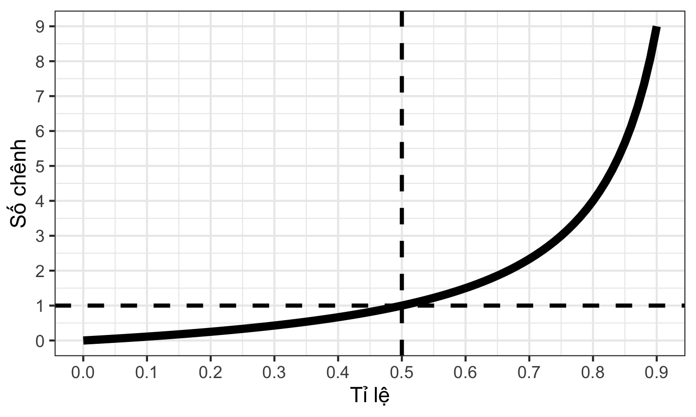

```{r setup, include=FALSE}
options(htmltools.dir.version = FALSE)
```

```{r xaringan-themer, include = FALSE}
library(xaringanthemer)
style_mono_light(
  base_color = "#002147",
  header_font_google = google_font('Yanone Kaffeesatz'),
  text_font_google   = google_font("Yanone Kaffeesatz"),
  code_font_google   = google_font("Inconsolata", "monospace"),
  base_font_size = "20px",
  text_font_size = "1.5rem"
)
```

background-image: url("figures/outcomesgraduates_2018.png")
background-position: center top
background-size: 100% 90%

.footnote[
UK General Medical Council (2018) Outcomes for graduates.
]

---

background-image: url("figures/outcomesgraduates_20182.png")
background-position: center top
background-size: 100% 90%

.footnote[
UK General Medical Council (2018) Outcomes for graduates.
]

---

background-image: url("figures/news_intervention.png")
background-position: center middle
background-size: 100% 100%

---

# Mục tiêu

1. Tính toán được những số đo kết hợp, gồm nguy cơ tương đối, tỉ số số chênh, nguy cơ qui trách, và nguy cơ qui trách dân số.

2. Lý giải được ý nghĩa của những số đo nói trên để xác định được một nguyên nhân gây bệnh, và lượng giá được tác động của nguyên nhân đó đối với tình trạng sức khỏe của một cộng đồng.

---
class: inverse, center, middle

# KHÁI NIỆM CƠ BẢN

---

# Các số đo bệnh trạng

Các loại chỉ số

* Tần số: $a$
* Tỉ lệ: $a/(a + b)$
* Số chênh: $a/b$
* Tỉ suất: $a/\text{Tổng thời gian theo dõi}$

---

# Các số đo bệnh trạng

Số hiện mắc (prevalence)

* Số ca hiện mắc (prevalence count)
* Tỉ lệ hiện mắc (prevalence proportion)
* Số chênh hiện mắc (prevalence odds)

--

Số mới mắc (incidence)

* Số ca mới mắc (incidence count)
* Tỉ lệ mới mắc (incidence proportion) = nguy cơ (risk)
* Số chênh mới mắc (incidence odds)
* Tỉ suất mới mắc (incidence rate)

---

# Tỉ lệ và số chênh


--

 

 

 

 

 

$$
\text{Số chênh} = \frac{\text{Tỉ lệ}}{\text{1 - Tỉ lệ}} = \frac{\text{Tần số có}}{\text{Tần số không}}
$$
---

# Tỉ lệ và số chênh



--

 

 

 

 

 

Số chênh luôn $\geq$ tỉ lệ

Khi tỉ lệ $< 0.05$, số chênh $\approx$ tỉ lệ

Khi số chênh $> 1$ thì tỉ lệ $> 0.5$

---

# Số đo kết hợp

--

Giúp trả lời 2 câu hỏi

1. Có hay không mối liên quan giữa phơi nhiễm và bệnh?

2. Nếu phơi nhiễm thực sự gây ra bệnh, can thiệp vào yếu tố phơi nhiễm giúp cải thiện tình trạng bệnh như thế nào?


---

# Bảng 2 x 2


---

# Thảo luận theo phương pháp Jigsaw

--

```{r, echo=FALSE, out.width=900, fig.align="center"}
knitr::include_graphics(path = file.path("figures", "jigsaw6_01.png"))
```

---

# Thảo luận theo phương pháp Jigsaw

```{r, echo=FALSE, out.width=900, fig.align="center"}
knitr::include_graphics(path = file.path("figures", "jigsaw6_02.png"))
```

---

# Thảo luận theo phương pháp Jigsaw

```{r, echo=FALSE, out.width=900, fig.align="center"}
knitr::include_graphics(path = file.path("figures", "jigsaw6_03.png"))
```

---

# Thảo luận theo phương pháp Jigsaw

```{r, echo=FALSE, out.width=900, fig.align="center"}
knitr::include_graphics(path = file.path("figures", "jigsaw6_04.png"))
```

---

background-image: url("figures/elearning_01.png")
background-position: center middle
background-size: 100% 100%

---

background-image: url("figures/elearning_02.png")
background-position: center middle
background-size: 100% 100%

---

# Thảo luận

Sự hiện của chất G trong máu và Nhồi máu cơ tim (NMCT)


---

# Thảo luận

Sự hiện của chất G trong máu và Nhồi máu cơ tim (NMCT)


---

# Thảo luận

Sự hiện của chất G trong máu và Nhồi máu cơ tim (NMCT)


---

# Thảo luận

Sự hiện của chất G trong máu và Nhồi máu cơ tim (NMCT)


---

# Thảo luận

Sự hiện của chất G trong máu và Nhồi máu cơ tim (NMCT)


&nbsp;

&nbsp;

&nbsp;

&nbsp;

&nbsp;

Tính các số đo bệnh trạng (nguy cơ, số chênh) và đưa ra nhận định

---
class: inverse, center, middle

# SỐ ĐO MỐI LIÊN QUAN (DẠNG TƯƠNG ĐỐI)

---


--

&nbsp;

&nbsp;

&nbsp;

&nbsp;

&nbsp;

Nguy cơ NMCT trong 5 năm ở nhóm G(+): $R_1 = 200/2000 = 0.10$

--

Nguy cơ NMCT trong 5 năm ở nhóm G(-): $R_0 = 100/2000 = 0.05$

--

Nguy cơ tương đối NMCT: $R_1/R_0 = 0.10/0.05 = 2$ 

---

# Nguy cơ tương đối (relative risk, risk ratio, RR)

--

$$
RR = \frac{\text{Nguy cơ mắc bệnh ở nhóm phơi nhiễm}}{\text{Nguy cơ mắc bệnh ở nhóm không phơi nhiễm}} = \frac{R_1}{R_0}
$$
--

Đo lường mức độ kết hợp/liên quan giữa phơi nhiễm và bệnh:

* Nếu $RR = 1$: nguy cơ mắc bệnh ở 2 nhóm tương đương nhau. Phơi nhiễm không liên quan đến bệnh.

* Nếu $RR > 1$: nhóm phơi nhiễm có nguy cơ mắc bệnh cao gấp $RR$ lần so với nhóm không phơi nhiễm. Yếu tố nguy cơ.

* Nếu $RR < 1$: nhóm phơi nhiễm có nguy cơ mắc bệnh thấp bằng $RR$ lần so với nhóm không phơi nhiễm. Yếu tố bảo vệ.

---


--

&nbsp;

&nbsp;

&nbsp;

&nbsp;

&nbsp;

Nguy cơ NMCT ở nhóm G(+): $R_1 = 200/346 = 0.58 \neq 0.10$

--

Nguy cơ NMCT ở nhóm G(-): $R_0 = 100/254 = 0.39 \neq 0.05$

--

Nguy cơ tương đối NMCT: $R_1/R_0 = 0.58/0.39 = 1.47 \neq 2$ 

--

Nguy cơ NMCT của mỗi nhóm và nguy cơ tương đối không phản ánh nguy cơ NMCT và nguy cơ tương đối thực sự !!! 

---

# Nguy cơ tương đối (relative risk, risk ratio, RR)


$$
RR = \frac{\text{Nguy cơ mắc bệnh ở nhóm phơi nhiễm}}{\text{Nguy cơ mắc bệnh ở nhóm không phơi nhiễm}} = \frac{R_1}{R_0}
$$

Đo lường mức độ kết hợp/liên quan giữa phơi nhiễm và bệnh:

* Nếu $RR = 1$: nguy cơ mắc bệnh ở 2 nhóm tương đương nhau. Phơi nhiễm không liên quan đến bệnh.

* Nếu $RR > 1$: nhóm phơi nhiễm có nguy cơ mắc bệnh cao gấp $RR$ lần so với nhóm không phơi nhiễm. Yếu tố nguy cơ.

* Nếu $RR < 1$: nhóm phơi nhiễm có nguy cơ mắc bệnh thấp bằng $RR$ lần so với nhóm không phơi nhiễm. Yếu tố bảo vệ.

Không phải lúc nào cũng tính được (nghiên cứu bệnh chứng, nghiên cứu cắt ngang)

---


--

&nbsp;

&nbsp;

&nbsp;

&nbsp;

&nbsp;

Số chênh NMCT trong 5 năm ở nhóm G(+): $O_1 = 200/1800 = 0.11$

--

Số chênh NMCT trong 5 năm ở nhóm G(-): $O_0 = 100/1900 = 0.05$

--

Tỉ số số chênh NMCT: $O_1/O_0 = 0.11/0.05 = 2.11$ 

---

# Tỉ số số chênh (odds ratio, OR)

--

$$
\text{OR bệnh} = \frac{\text{Số chênh mắc bệnh ở nhóm phơi nhiễm}}{\text{Số chênh mắc bệnh ở nhóm không phơi nhiễm}} = \frac{O_1}{O_0}
$$
--

Đo lường mức độ kết hợp/liên quan giữa phơi nhiễm và bệnh:

* Nếu $OR = 1$: số chênh mắc bệnh ở 2 nhóm tương đương nhau. Phơi nhiễm không liên quan đến bệnh.

* Nếu $OR > 1$: nhóm phơi nhiễm có số chênh mắc bệnh cao gấp $OR$ lần so với nhóm không phơi nhiễm. Yếu tố nguy cơ.

* Nếu $OR < 1$: nhóm phơi nhiễm có số chênh mắc bệnh thấp bằng $OR$ lần so với nhóm không phơi nhiễm. Yếu tố bảo vệ.

---


--

&nbsp;

&nbsp;

&nbsp;

&nbsp;

&nbsp;

Số chênh G(+) ở nhóm NMCT(+): $O_1 = 200/100 = 2.00$

--

Số chênh G(+) ở nhóm NMCT(-): $O_0 = 1800/1900 = 0.95$

--

Tỉ số số chênh G(+): $O_1/O_0 = 2.00/0.95 = 2.11$ 

---

# Tỉ số số chênh (odds ratio, OR)

$$
\text{OR phơi nhiễm} = \frac{\text{Số chênh phơi nhiễm ở nhóm bệnh}}{\text{Số chênh phơi nhiễm ở nhóm không mắc bệnh}} = \frac{O_1}{O_0}
$$

$\text{OR phơi nhiễm} = \text{OR bệnh} = \frac{a \times d}{b \times c}$

---


--

&nbsp;

&nbsp;

&nbsp;

&nbsp;

&nbsp;

Số chênh NMCT(+) ở nhóm G(+): $O_1 = 200/146 = 1.37 \neq 0.11$

--

Số chênh NMCT(+) ở nhóm G(-): $O_0 = 100/154 = 0.65 \neq 0.05$

--

Tỉ số số chênh NMCT: $O_1/O_0 = 1.37/0.65 = 2.11$ 

--

Số chênh NMCT của mỗi nhóm không phản ánh số chênh NMCT thực sự, tuy nhiên tỉ số số chênh NMCT vẫn phản ánh đúng tỉ số số chênh NMCT thực sự !!! 

---


--

&nbsp;

&nbsp;

&nbsp;

&nbsp;

&nbsp;

Số chênh G(+) ở nhóm NMCT(+): $O_1 = 200/100 = 2.00$

--

Số chênh G(+) ở nhóm NMCT(-): $O_0 = 146/154 = 0.95$

--

Tỉ số số chênh G(+): $O_1/O_0 = 2.00/0.95 = 2.11$ 

--

Số chênh G(+) của mỗi nhóm và tỉ số số chênh G(+) phản ánh số chênh và tỉ số số chênh thực sự !!! 

---

# Tỉ số số chênh (odds ratio, OR)

--

Đo lường mức độ kết hợp/liên quan giữa phơi nhiễm và bệnh:

* Nếu $OR = 1$: Phơi nhiễm không liên quan đến bệnh.

* Nếu $OR > 1$: Yếu tố nguy cơ.

* Nếu $OR < 1$: Yếu tố bảo vệ.

$\text{OR phơi nhiễm} = \text{OR bệnh} = \frac{a \times d}{b \times c}$

Nghiên cứu bệnh chứng: số chênh và OR phơi nhiễm ước tính đúng số chênh và OR phơi nhiễm thực sự 

--

Khi bệnh hiếm: OR $\approx$ RR

---
class: inverse, center, middle

# SỐ ĐO TÁC ĐỘNG (DẠNG TUYỆT ĐỐI)

---

# Nguy cơ quy trách (attributable risk, AR)

$$
AR = R_1 - R_0
$$
--

Nếu phơi nhiễm thực sự gây ra bệnh, trong số những người có phơi nhiễm, bao nhiêu người mắc bệnh thực sự do yếu tố phơi nhiễm.

--

Nếu phơi nhiễm là yếu tố thay đổi được:

Nếu phơi nhiễm thực sự gây ra bệnh, trong số những người có phơi nhiễm, có thể ngăn ngừa được bao nhiêu người mắc bệnh bằng cách loại bỏ yếu tố phơi nhiễm.

---


--

&nbsp;

&nbsp;

&nbsp;

&nbsp;

&nbsp;

Nguy cơ NMCT trong 5 năm ở nhóm G(+): $R_1 = 200/2000 = 0.10$

--

Nguy cơ NMCT trong 5 năm ở nhóm G(-): $R_0 = 100/2000 = 0.05$

--

Nguy cơ NMCT quy trách cho G(+): $R_1 - R_0 = 0.10 - 0.05 = 0.05$ 

---


--

&nbsp;

&nbsp;

&nbsp;

&nbsp;

&nbsp;

Khảo sát 100 người có G(+)

--

10 người sẽ có NMCT trong vòng 5 năm ( $R_1 = 0.10$ )

--

Trong đó, 5 người có NMCT do nguyên nhân khác ngoài G(+) ( $R_0 = 0.05$ )

--

5 người có NMCT do nguyên nhân từ G(+)

--

Nếu tác động khiến G(+) thành G(-), có thể ngăn ngừa được NMCT trên 5 người

---

# Phần trăm nguy cơ qui trách (AR%)

--

$$
AR\% = \frac{AR}{R_1} = (R_1 - R_0):R_1
$$

--

Nếu phơi nhiễm thực sự gây ra bệnh, trong số những người có phơi nhiễm, bao nhiêu % người mắc bệnh thực sự do yếu tố phơi nhiễm.  

--

Nếu phơi nhiễm thực sự gây ra bệnh, trên những người có phơi nhiễm, có thể ngăn ngừa được bao nhiêu % người mắc bệnh bằng cách loại trừ yếu tố phơi nhiễm. 

---

# Nguy cơ qui trách dân số (PAR)

--

$$
PAR = R_T - R_0
$$
trong đó $R_T$ là nguy cơ mắc bệnh trong toàn bộ dân số

--

Nếu phơi nhiễm thực sự gây ra bệnh, trong toàn bộ dân số, bao nhiêu người mắc bệnh thực sự do yếu tố phơi nhiễm.

--

Nếu phơi nhiễm thực sự gây ra bệnh, trong toàn bộ dân số, có thể ngăn ngừa được bao nhiêu người mắc bệnh bằng cách loại bỏ yếu tố phơi nhiễm.

---


--

&nbsp;

&nbsp;

&nbsp;

&nbsp;

&nbsp;

Nguy cơ NMCT trong 5 năm trong toàn bộ dân số: $R_T = 300/4000 = 0.075$

--

Nguy cơ NMCT trong 5 năm ở nhóm G(-): $R_0 = 100/2000 = 0.05$

--

Nguy cơ NMCT quy trách dân số: $R_T - R_0 = 0.075 - 0.05 = 0.025$ 

---


--

&nbsp;

&nbsp;

&nbsp;

&nbsp;

&nbsp;

Khảo sát 1000 người trong dân số

--

75 người sẽ có NMCT trong vòng 5 năm ( $R_T = 0.075$ )

--

Trong đó, 50 người có NMCT do nguyên nhân khác ngoài G(+) ( $R_0 = 0.05$ )

--

25 người có NMCT do nguyên nhân từ G(+)

--

Nếu tác động khiến G(+) thành G(-), có thể ngăn ngừa được NMCT trên 25 người

---

# Phần trăm nguy cơ qui trách dân số (PAR%)

$$
PAR\% = PAR/R_T = (R_T - R_0):R_T
$$

--

Nếu phơi nhiễm thực sự gây ra bệnh, trong toàn bộ dân số, bao nhiêu % người mắc bệnh thực sự do yếu tố phơi nhiễm.  

--

Nếu phơi nhiễm thực sự gây ra bệnh, trong toàn bộ dân số, có thể ngăn ngừa được bao nhiêu % người mắc bệnh bằng cách loại trừ yếu tố phơi nhiễm. 

---
class: inverse, center, middle

# KẾT LUẬN

---

# Kết luận

--

* Số đo kết hợp giúp trả lời câu hỏi
    + Có hay không mối liên quan giữa phơi nhiễm và bệnh?
    + Nếu phơi nhiễm gây ra bệnh, can thiệp vào yếu tố phơi nhiễm giúp cải thiện tình trạng bệnh như thế nào?

--

* Có hay không mối liên quan giữa phơi nhiễm và bệnh?
    + Số đo liên quan
    + Tỉ số nguy cơ/Nguy cơ tương đối (RR)
    + Tỉ số số chênh (OR)
    + So với 1

--

* Hiệu quả của việc can thiệp vào nguyên nhân gây ra bệnh?
    + Số đo tác động
    + Nguy cơ quy trách (AR), % nguy cơ quy trách (AR%)
    + Nguy cơ quy trách dân số (PAR), % nguy cơ quy trách dân số (PAR%)

---

# Tài liệu tham khảo 

* Daniel Westreich (2020) Epidemiology by Design: A Causal Approach to the Health Sciences. Oxford University Press.

---
class: center, middle

# CÁM ƠN CÁC EM ĐÃ THAM GIA BUỔI HỌC !

Nhận xét về buổi học

```{r, echo=FALSE, out.width=400, fig.align="center"}
knitr::include_graphics(path = file.path("figures", "SDKH_eval.png"))
```

