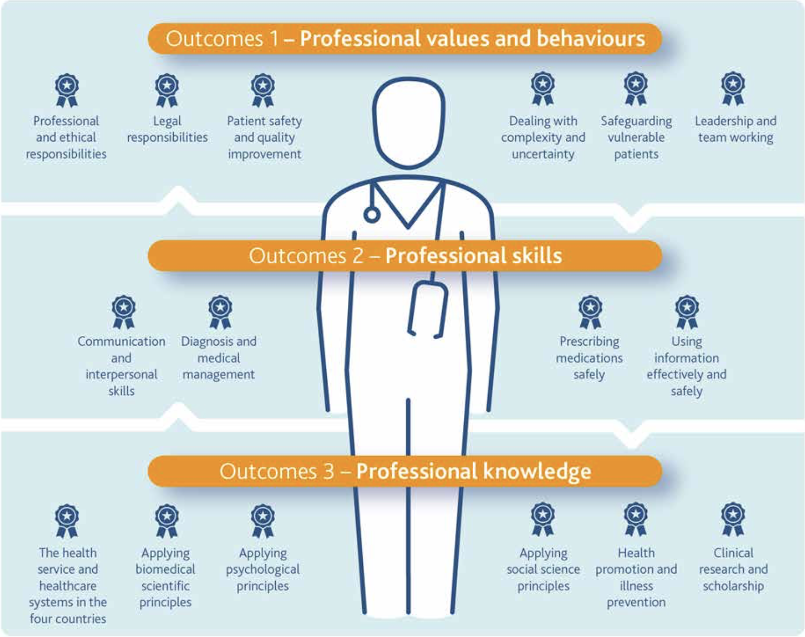
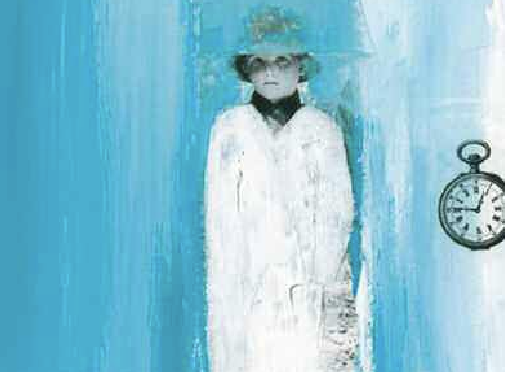

```{r setup, include=FALSE}
options(htmltools.dir.version = FALSE)
```

```{r xaringan-themer, include = FALSE}
library(xaringanthemer)
style_mono_light(
  base_color = "#002147",
  header_font_google = google_font('Yanone Kaffeesatz'),
  text_font_google   = google_font("Yanone Kaffeesatz"),
  code_font_google   = google_font("Inconsolata", "monospace"),
  base_font_size = "20px",
  text_font_size = "1.5rem"
)
```

background-image: url("figures/tomorrowdoctor_20032.png")
background-position: center
background-size: cover

.footnote[
UK General Medical Council (2003) Tomorrow’s doctors.
]

---

# Người bác sĩ tương lai

> Medical students are .ered[tomorrow’s doctors]. In
accordance with Good medical practice, newly
qualified doctors must make the care of patients their
first concern, applying their knowledge and skills in a
competent, ethical and professional manner and taking
responsibility for their own actions in complex and
uncertain situations.

.footnote[
UK General Medical Council (2018) Outcomes for graduates.
]

---
background-image: url("figures/outcomesgraduates_2018.png")
background-position: center top
background-size: 100% 90%

.footnote[
UK General Medical Council (2018) Outcomes for graduates.
]

---




---


